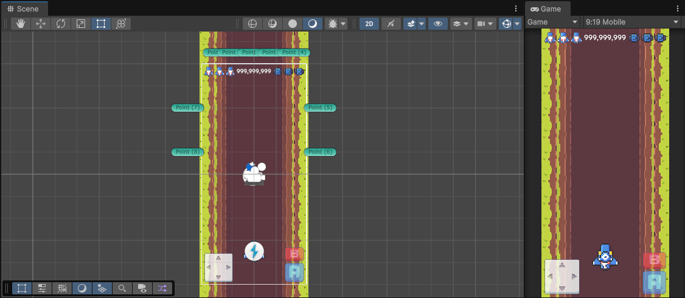
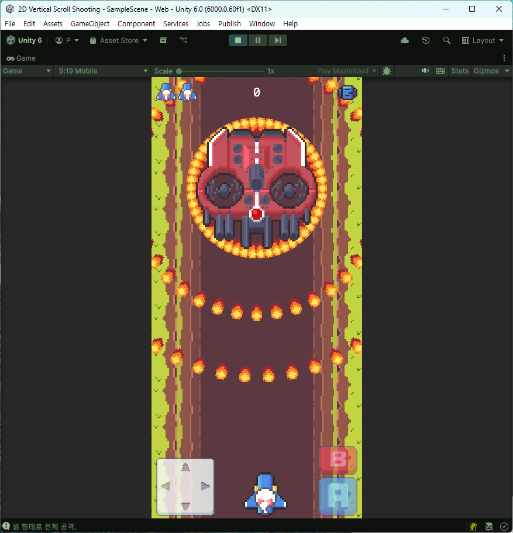

# Unity_2D_Vertical_Scroll_Shooting

플레이어는 비행기를 조종하여 화면 위에서 아래로 내려오는 적 비행기와 보스를 물리치고, 최대한 높은 점수를 얻는 것을 목표로 합니다.  
모든 스테이지를 성공적으로 클리어하면 게임이 완료됩니다.

# Play URL
https://play.unity.com/ko/games/a7388f57-4c69-4e9c-818d-627d9a6e8b90/2d-vertical-scroll-shooting

---

## 🎮 게임 목표

- 적 비행기 및 보스를 처치
- 최대한 높은 점수 획득
- 모든 스테이지 클리어 시 게임 완료

---

## 📜 게임 방법 및 규칙

### 1) 스테이지 진행
- 게임은 여러 스테이지로 구성됩니다.
- 각 스테이지는 고유한 적 등장 패턴을 가집니다.
- 현재 스테이지의 **모든 적과 보스**를 처치하면 다음 스테이지로 넘어갑니다.

### 2) 생명력 (Life)
- 플레이어는 시작 시 **생명력 3개**를 가집니다.
- 적 비행기 또는 적의 총알에 피격되면 **생명력 1 감소**합니다.
- 생명력이 **0이 되면 게임 오버**입니다.

### 3) 부활 (Respawn)
- 피격 후 플레이어 비행기는 잠시 사라졌다가 부활합니다.
- 부활 후 **짧은 시간 동안 무적 상태**가 됩니다.

### 4) 점수 (Score)
- 적을 파괴하면 점수를 획득합니다.
- 특정 아이템 획득 시 추가 점수를 얻을 수 있습니다.

### 5) 아이템 (Item Drop)
적을 파괴하면 아래 아이템 중 하나가 드롭될 수 있습니다.

- **코인 (Coin)**  
  - 점수 **+1,000**

- **파워 (Power)**  
  - 플레이어의 기본 공격(총알)을 강화합니다.
  - **최대 파워 상태에서 획득 시 추가 점수**를 얻습니다.
  - 파워 레벨이 올라가면 플레이어를 따라다니며 함께 공격하는 **Follower**가 추가됩니다.

- **폭탄 (Boom)**  
  - 화면 내 모든 적에게 피해를 주고 **적의 총알을 제거**합니다.
  - 폭탄 아이템을 **1개 획득**합니다.

### 6) 폭탄 사용 (Special Attack)
- 보유한 폭탄을 사용하여 화면의 모든 적에게 큰 피해를 주고 **적의 총알을 즉시 제거**합니다.
- 폭탄은 **동시에 최대 1개만 보유**할 수 있습니다.

### 7) 게임 오버
- 모든 생명력을 잃으면 게임 오버 화면이 나타납니다.
- 게임을 다시 시작할 수 있는 옵션이 제공됩니다.

---

## 🕹️ 조작 방법

### 이동
- **키보드:** `W A S D` 또는 방향키 `↑ ↓ ← →`
- **터치스크린:** 화면의 가상 조이스틱

### 공격 (기본 발사)
- **키보드:** 마우스 **왼쪽 버튼**
- **터치스크린:** 화면 우측 UI의 **A 버튼** 탭

### 폭탄 사용 (특수 공격)
- **키보드:** 마우스 **오른쪽 버튼**
- **터치스크린:** 화면 우측 UI의 **B 버튼** 탭

---

## 📚 학습 자료 정보

- **영상 제목:** [유니티 게임개발] 비행기🛩️종스크롤 슈팅 .U19C4  
- **채널:** 골드메탈  
- **링크:** https://youtu.be/ETYzjbnLixY

---

# 📦 사용된 유니티 기능 및 구현된 시스템

---

## 🛩️ 플레이어 시스템

### 플레이어 이동
- 키보드(WASD / 방향키) 및 터치 입력을 통한 이동
- 화면 경계 체크를 통한 이동 제한

### 발사체 (Projectile)
- 플레이어 및 적 공용 발사체 시스템
- 발사 속도, 방향, 데미지 분리 관리

### 플레이어 피격
- 적 탄환 및 적 비행체와 충돌 시 생명력 감소
- 피격 후 일정 시간 무적 처리 (Invincibility)

---

## 👾 적 시스템

### 적 비행체
- 다양한 이동 패턴을 가진 적 비행기 구현
- 충돌 시 플레이어에게 피해

### 탄막 보스
- 다수의 탄환을 동시에 발사하는 보스 패턴
- 패턴 기반 공격 로직 구성

### 텍스트 파일 기반 적 배치
- 외부 텍스트 파일을 통해 적 등장 타이밍 및 위치 제어
- 스테이지 데이터와 로직 분리로 유지보수 용이

---

## 🔫 전투 보조 시스템

### 따라다니는 보조 무기 (Follower)
- 파워업 획득 시 플레이어를 따라다니며 자동 공격
- 파워 레벨에 따라 개수 증가

---

## 🎁 아이템 시스템

### 파워업 아이템
- 플레이어 기본 공격 강화
- 최대 파워 도달 시 점수 보너스 처리

### 필살기 아이템 (폭탄)
- 화면 내 모든 적에게 피해
- 적 탄환 즉시 제거
- 보유 개수 제한 (최대 1개)

---

## 🌌 환경 및 최적화

### Parallax Scrolling 배경
- 다중 배경 레이어를 이용한 시차 스크롤링
- 진행 방향에 따른 자연스러운 속도 차이 연출

### 오브젝트 풀링 (Object Pooling)
- 총알, 적, 이펙트 등 빈번히 생성/삭제되는 오브젝트 재사용
- 성능 최적화 및 GC 발생 최소화
